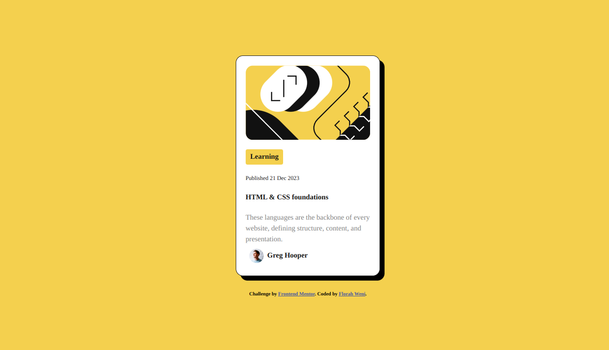
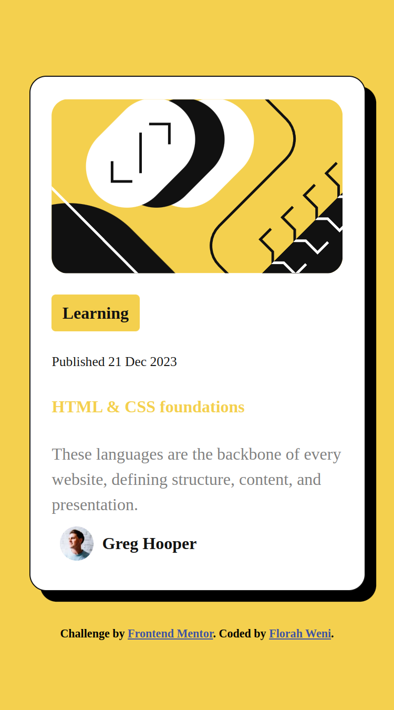

# Frontend Mentor - Blog preview card solution

This is a solution to the [Blog preview card challenge on Frontend Mentor](https://www.frontendmentor.io/challenges/blog-preview-card-ckPaj01IcS). Frontend Mentor challenges help you improve your coding skills by building realistic projects. 

## Table of contents

- [Overview](#overview)
  - [The challenge](#the-challenge)
  - [Screenshot](#screenshot)
  - [Links](#links)
- [My process](#my-process)
  - [Built with](#built-with)
  - [What I learned](#what-i-learned)
  - [Continued development](#continued-development)
  - [Useful resources](#useful-resources)
- [Author](#author)

## Overview

A blog preview card, newbie Frontend Mentor challenge. This is the third challenge that I have taken up. I have decided to continue developing the solution with HTML and CSS. 

### The challenge

Users should be able to:

- See hover and focus states for all interactive elements on the page

### Screenshot

#### Desktop

#### Mobile

### Links

- Solution URL: [Solution](https://github.com/FWeni/Blog-Preview-Card)
- Live Site URL: [live site URL](https://fweni.github.io/Blog-Preview-Card)

## My process

### Built with

- Semantic HTML5 markup
- CSS custom properties
- Flexbox
- CSS Grid
- Mobile-first workflow

### What I learned

I recalled some of the implementations from my previous tasks. 

### Continued development

I want to continue developing with HTML, CSS and Javascript, on a couple of projects. I want to truly learn responsive web development. 

### Useful resources

- [w3schools](https://www.w3schools.com/) - This helped me with implementing some compontents in the solution. like making certian sections of the text be bold, I used the b tag and hr tag I used for the line that is acting as a divider.
- [Deque University](https://dequeuniversity.com/rules/axe/4.6/region?application=axeAPI) - This is an amazing article which helped me finally understand the landmarks. I'd recommend it to anyone who is still new to HTML or coding.
- [Piccalilli](https://piccalil.li/blog/a-more-modern-css-reset/) - I have referenced how to reset css from this site.

## Author

- Frontend Mentor - [@FWeni](https://www.frontendmentor.io/profile/FWeni)
